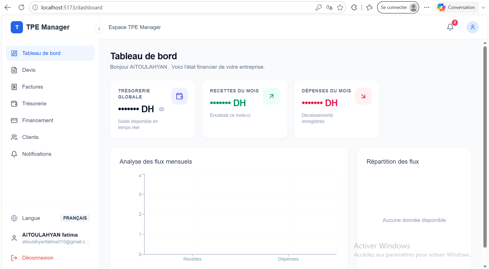
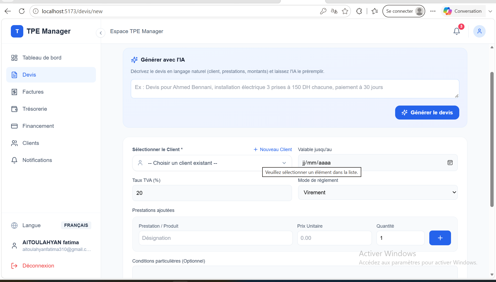
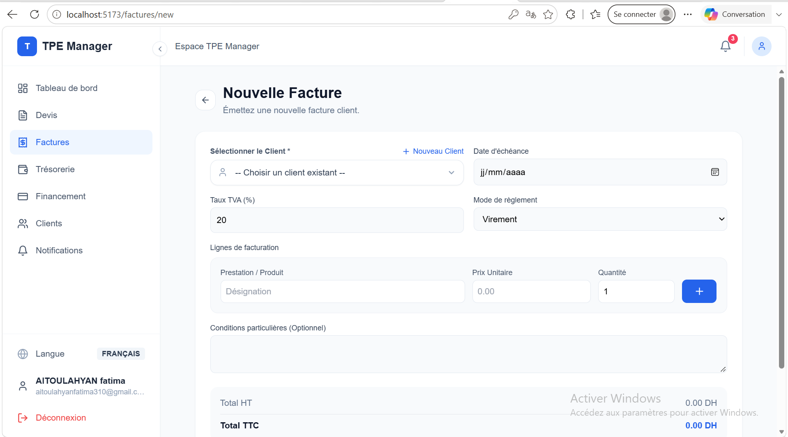

# TPE Manager — Web

A billing and invoicing platform for small Moroccan businesses (TPEs). Web application built with React, covering quotes, invoices, cash flow tracking, and credit requests.

> This repository contains the web frontend. The backend (Django REST) and the mobile app (Flutter) are maintained in separate repositories.

## Preview

### Dashboard


### Quotes list


### Creating a quote


### Invoicing


##  Features

- **Authentication** — sign up, login, forgot password (email code), JWT with automatic token refresh
- **Dashboard** — balance, statistics, charts (bar/pie)
- **Quotes** — creation, full lifecycle tracking (draft → sent → accepted/rejected/expired), AI-assisted quote generation from a natural language description
- **Invoicing** — invoice creation, payment tracking, statuses
- **Cash flow** — transaction tracking, chart visualization
- **Credit** — eligibility scoring, requests and supporting documents
- **Clients** — client management
- **Notifications** — tax declaration reminders (Jan 1, Apr 1, Jul 1, Oct 1), push notifications
- **Profile** — per-user SMTP configuration, password change
- **Internationalization** — French and Arabic UI

##  Tech stack

- **React** (Vite)
- **Redux Toolkit** — global state management (auth, UI)
- **Axios** — HTTP client with JWT interceptors
- **React Hook Form** — form handling
- **Tailwind CSS** — styling
- Feature-based architecture (`features/`) with separated components and pages

##  Project structure

```
src/
├── core/                 # API config, hooks, constants
├── store/                # Redux Toolkit (slices)
├── features/             # Business modules (auth, dashboard, devis, factures, cashflow, credit, clients, notifications, profile)
├── shared/                # Reusable UI components, layout, utils
└── routes/                # Routing (React Router)
```

##  Getting started

### Prerequisites
- Node.js 18+
- The TPE Manager backend must be running (see the backend repository)

### Steps

```bash
git clone  https://github.com/fatima-aitoulahyan/tpe-manager-web.git
cd tpe_web
npm install
```

```
VITE_API_URL=http://localhost:8000/api
```

Start the development server:

```bash
npm run dev
```

The app will be available at `http://localhost:5173`.

##  Available scripts

| Command | Description |
|---|---|
| `npm run dev` | Starts the development server |
| `npm run build` | Production build |
| `npm run preview` | Preview the production build |

##  Security

JWT tokens are stored client-side and refreshed automatically via an Axios interceptor. The `.env` file (containing the API URL) is not versioned — see `.env.example` for the required configuration.
